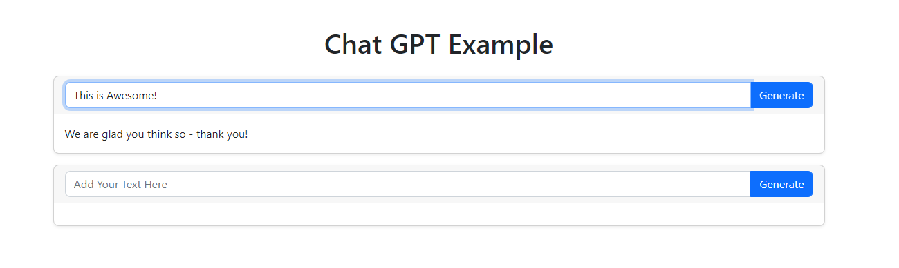

# OpenaiChatbotSpike

## Development server

Run `ng serve` for a dev server. Navigate to `http://localhost:4200/`. The application will automatically reload if you change any of the source files.

## Openai ApiKey
Add your apikey to the todo in openai.service.ts
[Find your apikey here](https://platform.openai.com/account/api-keys)

### Openai model is "gpt-3.5-turbo".
#### Currently waiting for access to "gpt-4/gpt-4-32k-0314"
